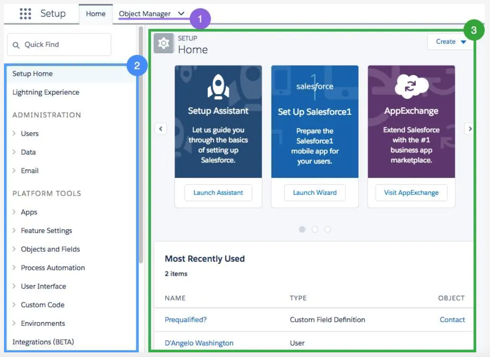
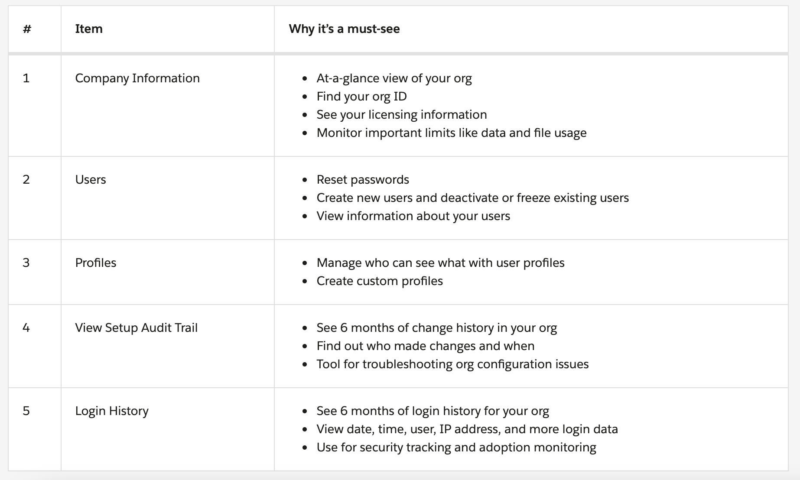

# Navigate Setup

## Setup

1. `Object Manager`: Object Manager is where you can view and customize standard and custom objects in your org.
2. `Setup Menu`: The menu gives you quick links to a collection of pages that let you do everything from managing your users to modifying security settings.
3. `Main Window`: We’re showing you the Setup home page, but this is where you can see whatever it is you’re trying to work on.

## Setup Menu

There are three main categories in the Setup menu: `Administration`, `Platform Tools`, and `Settings`.

- `Administration`: The Administration category is where you manage your users and data. You can do things like add users, change permissions, import and export data, and create email templates.
- `Platform Tools`: You do most of your customization in Platform Tools. You can view and manage your data model, create apps, modify the user interface, and deploy new features to your users. If you decide to try your hand at programmatic development, Platform Tools is where you manage your code as well.
- `Settings`: Finally, Settings is where you manage your company information and org security. You can do things like add business hours, change your locale, and view your org’s history.

## Quiz

### 1. The Company Information page is where you can find:

- A. Your org ID
- B. License available and in use
- C. Information on important limits such as data and file usage
- D. :heavy_check_mark:All of the above

### 2. What are the three main categories in the Setup menu?

- A. Object Management, Preferences, Groups
- B. User Management, Settings, Security
- C. :heavy_check_mark:Adminstration, Platform Tools, Settings
- D. AppExchange, Profiles, Customizations

### 3. What is an easy way to find what you're looking for in the Setup menu?

- A. :heavy_check_mark:Type the first few letters of what you're looking for in the Quick Find box.
- B. Click headings and subheadings until you find what you're looking for.
- C. Memorize what's in each category.
- D. Click one of the main categories in the Setup menu, then look at the page to the right.
