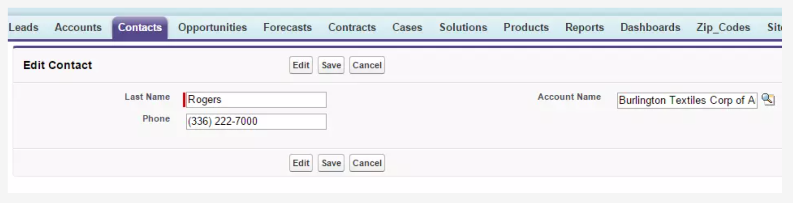

# Map .NET Concepts to the Lightning Platform

## Meet the Lightning Platform

### Platform Basics

One of the things that separates the platform from other software-as-a-service (`SaaS`) offerings is that it relies on a `metadata-driven` architecture. Everything, including the code, configuration, and apps, is specified as `metadata`.

### Object-oriented Design

`Apex` supports many of the `object-oriented` principles that you’re probably used to, such as `encapsulation`, `abstraction`, `inheritance`, and even `polymorphism`. In fact, the `Apex` language includes many language constructs you’re already familiar with, including `classes`, `interfaces`, `properties`, and `collections`.

An Apex class named HelloWorld would look like:

```
public with sharing class HelloWorld {
    public void printMessage() {
        String msg = 'Hello World';
        System.debug(msg);
    }
}
```

The basic syntax for defining classes is:

```
private | public | global
[virtual | abstract | with sharing | without sharing]
class ClassName [implements InterfaceNameList] [extends ClassName]
{
    // The body of the class
}
```

### Data Types

There are `primitive types`, such as `Integer`, `Double`, `Long`, `Date`, `Datetime`, `String`, and `Boolean`.

There is also an `ID data type` that is used for any valid 18-character Lightning Platform record identifier assigned by the system.

In `Apex`, all variables are initialized to `null` by default. One thing to be aware of is that `.NET` `strings` are actually references even though they behave like value types, because they’re `immutable`. But in `Apex`, `strings` are always treated as a `primitive value type`.

Besides `primitives`, supported data types include `sObjects`, either as a generic sObject or a specific one, such as an Account or Contact. Remember, an sObject is just a Salesforce object. You can think of it as a table in a database. The sObject can be either a standard one that comes built in with Salesforce or a custom one that you define yourself.

In Apex, you can use `enums` with `numbers`, but you can’t define what these number values are. Also, the ordinal assignment starts at `zero`. For example, if you had an enum like the following.

```
public enum myEnums {
            Enum1,
            Enum2,
            Enum3
 }
```

If you tried to access the ordinal value of the third enum, the value of the enumOrd variable would be `2`.

```
Integer enumOrd = myEnums.Enum3.ordinal();
```

### Working with Collections

#### List

A `list` in an `ordered collection of elements` that works much the same as a traditional array. In fact, arrays in Apex are synonymous with lists, and you can use them interchangeably. For example, the following is one way to declare a variable as a list of strings.

```
List<String> myStrings =  new List<String>();
```

Alternatively, you can declare the myStrings variable as an array but assign it to a list rather than an array.

```
String[] myStrings = new List<String>();
```

Another thing you can do is declare the list and initialize its values, all in one step, such as the following.

```
List<String> myStrings =  new List<String> {'String1', 'String2', 'String3' };
```

You can also add values to the list after it has been created, such as this:

```
List<String> myStrings = new List<String>();
myStrings.add('String1');
myStrings.add('String2');
myStrings.add('String3');
```

You’ll probably create a lot of list variables in your Apex development, because the output of every `SOQL query` is a `list`. For example, you could create a list of Accounts using code such as the following:

```
List<Account> myAccounts = [SELECT Id, Name FROM Account];
```

Like `arrays`, `lists` have `indexes` that start at `zero`. So you could access the name of the first account in the list with code like this:

```
List<Account> myAccounts = [SELECT Id, Name FROM Account];
String firstAccount = myAccounts[0].Name;
```

#### Set

A `set` is an `unordered collection of elements` that `does not contain duplicates`. A set is commonly used to store ID values because the value are always unique. You could then use the `set` as part of a `WHERE` clause in a SOQL query. For example, here we’re creating a set that contains two unique IDs for Accounts. We then use the set in the SOQL query to return Accounts only for those IDs.

```
Set<ID> accountIds = new
  Set<ID>{'001d000000BOaHSAA1','001d000000BOaHTAA1'};
List<Account> accounts = [SELECT Name
  FROM Account WHERE Id IN :accountIds];
```

#### Map

A map is a `collection` of `key-value pairs`. Each key maps to a single value. A `map` is useful when you need to quickly find something by a key. The key values must be unique, so you could have a map that contained ID values for the key and then mapped to an `sObject`. For example, you could use the following code to declare a map variable named accountMap that contains all Accounts mapped to their IDs.

```
Map<Id, Account> accountMap = new Map<Id, Account>([SELECT Id, Name FROM Account]);
```

You could then access a specific Account record using the get method and code similar to the following.

```
Id accId = '001d000000BOaHSAA1';
Account account = accountMap.get(accId);
```

### ASP.NET to Visualforce

`Visualforce` is a framework for `rendering HTML pages using an MVC paradigm`. Comparing the two is a bit like comparing apples and pumpkins. You can use either one to render web pages, and both separate the application logic from the markup and the database model, but they do so in different ways.

You can use the following markup code to render a simple page used to enter Contact data.

```
<apex:page standardController="Contact">
  <apex:form>
    <apex:pageBlock title="Edit Contact" mode="Edit">
       <apex:pageBlockButtons >
         <apex:commandButton action="{!edit}" id="editButton" value="Edit"/>
         <apex:commandButton action="{!save}" id="saveButton" value="Save"/>
         <apex:commandButton action="{!cancel}" id="cancelButton" value="Cancel"/>
       </apex:pageBlockButtons>
       <apex:pageBlockSection >
          <apex:inputField value="{!contact.lastname}" />
          <apex:inputField value="{!contact.accountId}"/>
          <apex:inputField value="{!contact.phone}"/>
       </apex:pageBlockSection>
    </apex:pageBlock>
  </apex:form>
</apex:page>
```

The example uses what is known as a `standard controller`, which is part of the Lightning Platform. It’s basically system-generated code that allows you to quickly incorporate basic CRUD functionality in your Visualforce pages. But before you start getting worried, just know that you can create your own custom controllers to add in more complex functioning. Learn all about how standard and custom controllers work in the Visualforce Basics module. The rendered version of this page looks like the following:



## What Is Different?

Now that you know a little about how Apex is similar to `.NET`, let’s go over some differences. For starters, unlike `C#`, `Apex` is not case sensitive.

### Apex and Database are Tightly Coupled

`Apex` code and the `Lightning Platform database` are tightly coupled to the point where they are sometimes indistinguishable. Each standard or custom object in the database has a "mystical" representation via an Apex class that provides all sorts of functionality to make interacting with the database a snap. The `class` and its `underlying object` are essentially a `mirror image` of one another that is constantly in sync. For instance, whenever you create a new field in an object, a class member is automatically surfaced to reference the values in the database. It's also `impossible` to add a `reference` in your Apex code to a field that doesn't exist; the compiler will return an error and simply not save your code. The platform works hard to ensure these dependencies and won't let the database schema and your code become out of sync. Therefore, if you attempt to delete a custom object or a field that is referenced by Apex code, the platform will raise an error and disallow the action.

### Unit Tests Are Required

What is different on the Lightning Platform is that you must have `75% test coverage` to deploy your Apex code to a `production org`.
