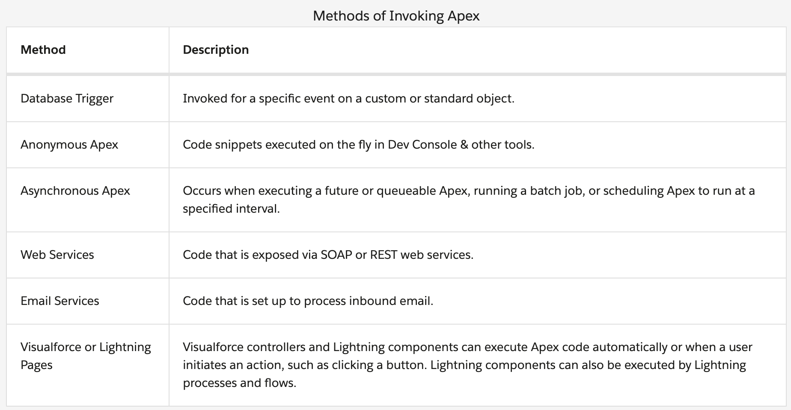
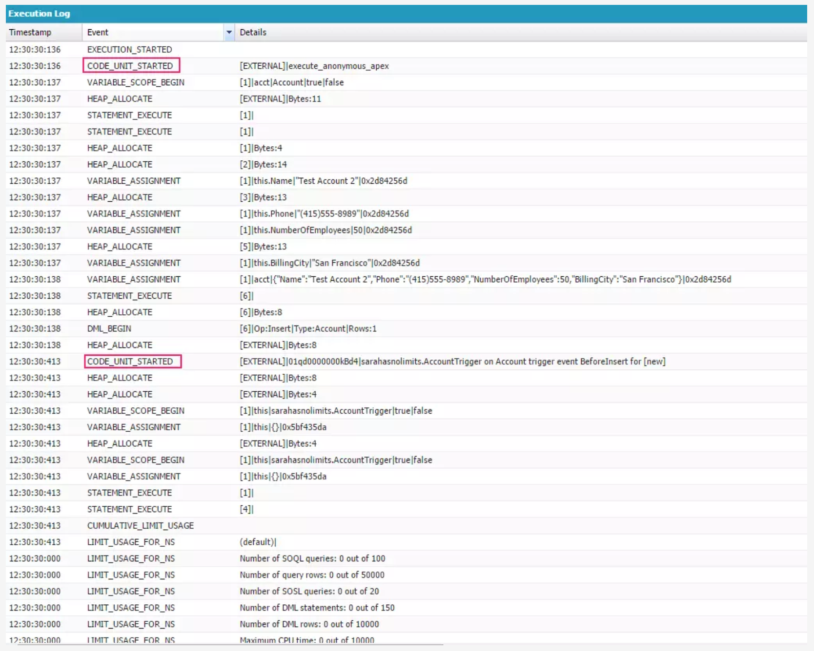

# Understand Execution Context

## Execution Context

For ASP.NET applications, code is executed in the context of an application domain.
In the Lightning Platform world, code executes within an execution context.



Besides invoking Apex code, **actions**, such as **creating a new task**, **sending an email**, **performing a field update**, or **sending an outbound message**, can all be triggered by one of the declarative platform features. These actions also run within an execution context.

Another important consideration is the context of the user executing the Apex code. **By default, Apex executes in system context**. Apex code has access to all **objects** and **fields**. Object permissions, field-level security, and sharing rules aren’t applied for the current user.

## Trigger Essentials

Similar to triggers in SQL Server, Apex database triggers execute programming logic before or after events to records in Salesforce. When defining the trigger, you can specify more than one of the following events:

- before insert
- before update
- before delete
- after insert
- after update
- after delete
- after undelete

The basic syntax for a trigger looks like the following:

```
trigger TriggerName on ObjectName (trigger_events) {
   // code_block
}
```

You only want to resort to using a trigger when you are absolutely sure that the same thing cannot be accomplished with one of our point-and-click automation tools.

## Mark Execution Context

An Apex database trigger that creates an opportunity when a new account is entered. This trigger calls a method from a handler class, so we first need to create that.

1. From Setup, select Your Name > **Developer Console** to open Developer Console.
2. In Developer Console, select **File** > **New** > **Apex Class**.
3. Enter AccountHandler for the class name and click OK.
4. Delete the existing code, and insert the following snippet:

```
public with sharing class AccountHandler {
    public static void CreateNewOpportunity(List<Account> accts) {
        for (Account a : accts) {
            Opportunity opp = new Opportunity();
            opp.Name = a.Name + ' Opportunity';
            opp.AccountId = a.Id;
            opp.StageName = 'Prospecting';
            opp.CloseDate = System.Today().addMonths(1);
            insert opp;
        }
    }
}
```

5. Press **Ctrl + S** to save your class.

Create the Account trigger

1. In Developer Console, select **File** > **New** > **Apex Trigger**.
2. Enter AccountTrigger as the name, and select Account as the sObject.
3. Click **Submit**.
4. Delete the existing code, and insert the following snippet:

```
trigger AccountTrigger on Account (before insert, before update, before
    delete, after insert, after update, after delete,  after undelete) {
    if (Trigger.isAfter && Trigger.isInsert) {
        AccountHandler.CreateNewOpportunity(Trigger.New);
    }
}
```

5. Press **Ctrl + S** to save your trigger.

Execute anonymous code to simulate a user entering a new Account using the Salesforce interface. Remember, Apex code can be executed a number of different ways.

1. From Setup, select Your Name > **Developer Console** to open Developer Console.
2. Select **Debug** > **Open Execute Anonymous Window**.
3. Delete the existing code, and insert the following snippet:

```
Account acct = new Account(
    Name='Test Account 2',
    Phone='(415)555-8989',
    NumberOfEmployees=50,
    BillingCity='San Francisco');
insert acct;
```

4. Make sure that the Open Log option is selected and click **Execute**. A new tab shows the execution log. Keep it open so that you can examine it carefully.

## Examining the Execution Log

Notice that the first line in the execution log marks the EXECUTION_STARTED event and that the last line is the EXECUTION_FINISHED event. Everything in between is the execution context.



The second **CODE_UNIT_STARTED** line that is highlighted represents when code for the **BeforeInsert** event was executed.

## Working with Limits

And this brings us back to the subject of working with limits. The two limits you will probably be the most concerned with involve the number of SOQL queries or DML statements. These tend to trip up developers new to the platform, so we wanted to spend some extra time focusing on how to avoid them.

### Working in Bulk

**Apex triggers** can receive **up** to **200 objects** at once. Currently, the synchronous limit for the total number of **SOQL queries** is **100**, and **150** for the total number of **DML** statements issued.

The trigger handler code we created earlier didn’t use a bulk pattern, and therefore it’s prone to limits errors. To remind you, below is what the original code looked like.

```
public with sharing class AccountHandler {
    public static void CreateNewOpportunity(List<Account> accts) {
        for (Account a : accts) {
            Opportunity opp = new Opportunity();
            opp.Name = a.Name + ' Opportunity';
            opp.AccountId = a.Id;
            opp.StageName = 'Prospecting';
            opp.CloseDate = System.Today().addMonths(1);
            insert opp;
        }
    }
}
```

Notice that the insert DML operation is inside the for loop. This is bad, very bad, and something to always avoid.

Changing it to write to a list variable inside of the loop and then insert the contents of the list in one step.

1. From Setup, select Your Name > **Developer Console** to open Developer Console.
2. In Developer Console, select **File** > **Open**.
3. For the entity type, select **Classes**. Select **AccountHandler** as the entity.
   Click **Open**.
4. Delete the existing code, and insert the following snippet:

```
public with sharing class AccountHandler {
    public static void CreateNewOpportunity(List<Account> accts) {
        List<Opportunity> opps = new List<Opportunity>();
        for (Account a : accts) {
            Opportunity opp = new Opportunity();
            opp.Name = a.Name + ' Opportunity';
            opp.AccountId = a.Id;
            opp.StageName = 'Prospecting';
            opp.CloseDate = System.Today().addMonths(1);
            opps.add(opp);
        }
        if (opps.size() > 0) {
            insert opps;
        }
    }
}
```

6. Press **Ctrl + S** to save your class.

Add unit test for the trigger:

1. In Developer Console, select **File** > **New** > **Apex Class**.
2. Enter AccountTrigger_Test for the class name and click **OK**.
3. Delete the existing code, and insert the following snippet:

```
@isTest
private class AccountTrigger_Test {
    @isTest static void TestCreateNewAccountInBulk() {
        // Test Setup data
        // Create 200 new Accounts
        List<Account> accts = new List<Account>();
        for(Integer i=0; i < 200; i++) {
            Account acct = new Account(Name='Test Account ' + i);
            accts.add(acct);
        }
        // Perform Test
        Test.startTest();
        insert accts;
        Test.stopTest();
        // Verify that 200 new Accounts were inserted
        List<Account> verifyAccts = [SELECT Id FROM Account];
        System.assertEquals(200, verifyAccts.size());
        // Also verify that 200 new Opportunities were inserted
        List<Opportunity> verifyOpps = [SELECT Id FROM Opportunity];
        System.assertEquals(200, verifyOpps.size());
    }
}
```

4. Press **Ctrl + S** to save your class.
5. Select **Test** > **New Run**.
6. Select AccountTrigger_Test as the TestClass, and TestCreateNewAccountInBulk as the test method.
7. Click **Run**.
8. Select the **Test** tab and verify that the test runs to completion with no failures, as indicated by a green checkmark in the Status column.
