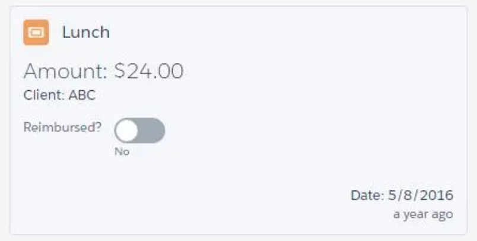

# Get Started with Aura Components

## Lightning Component Framework

**The Lightning Component framework** is a **UI framework** for developing **web apps** for **mobile** and **desktop** devices. It’s a modern framework for building **single-page applications** with dynamic, responsive user interfaces for Lightning Platform apps. It uses JavaScript on the client side and Apex on the server side.

## An Example Aura Component



Code:

```
<aura:component>
	<aura:attribute name="expense" type="Expense__c"/>
	<aura:registerEvent name="updateExpense" type="c:expensesItemUpdate"/>
	<!-- Color the item green if the expense is reimbursed -->
	<lightning:card title="{!v.expense.Name}" iconName="standard:scan_card"
									class="{!v.expense.Reimbursed__c ?
													'slds-theme_success' : ''}">
		<aura:set attribute="footer">
			<p>Date: <lightning:formattedDateTime value="{!v.formatdate}"/></p>
			<p class="slds-text-title"><lightning:relativeDateTime value="{!v.formatdate}"/></p>
		</aura:set>
		<p class="slds-text-heading_medium slds-p-horizontal_small">
			Amount: <lightning:formattedNumber value="{!v.expense.Amount__c}" style="currency"/>
		</p>
		<p class="slds-p-horizontal_small">
			Client: {!v.expense.Client__c}
		</p>
		<p>
			<lightning:input type="toggle"
												label="Reimbursed?"
												name="reimbursed"
												class="slds-p-around_small"
												checked="{!v.expense.Reimbursed__c}"
												messageToggleActive="Yes"
												messageToggleInactive="No"
												onchange="{!c.clickReimbursed}"/>
		</p>
	</lightning:card>
</aura:component>
```

First of all, it’s XML markup, and mixes both static HTML tags with custom Aura component tags, such as the `<aura:component>` tag that leads off the sample. If you’ve worked with Visualforce, the format of that tag is familiar: ` namespace``: ` `tagName` . As you’ll see later, built-in components can come from a variety of different namespaces, such as `aura:` (as here), or `force:`, `lightning:`, or `ui:`.

There are components like `<lightning:input>` and `<lightning:formattedNumber>`. Again, this is a pattern familiar to Visualforce developers. If you’re not one of those, for now we’ll say that you use the input component to collect user input, and the other components to display read-only values. Here are a few more components highlighted in the snippet.

- `<lightning:card>` creates a container around a group of information.
- `<lightning:formattedDateTime>` displays formatted date and time.
- `<lightning:relativeDateTime>` displays the relative time difference between the current time and the provided time.

Aura component markup is XML. But didn’t we say something about JavaScript earlier? Notice the `onchange="{!c.clickReimbursed}"` attribute on the toggle switch, which is really a fancy checkbox that slides right and left to represent checked and unchecked values. That means “when this value is changed, call the controller’s `clickReimbursed` function.” Let’s look at the code it’s attached to.

```
({
	clickReimbursed: function(component, event, helper) {
		let expense = component.get("v.expense");
		let updateEvent = component.getEvent("updateExpense");
		updateEvent.setParams({ "expense": expense });
		updateEvent.fire();
	}
})
```

This is the component’s client-side controller, written in JavaScript. The **clickReimbursed** function in the component’s controller corresponds to the `onchange="{!c.clickReimbursed}"` attribute on the checkbox in the component’s markup.

In the Aura Component programming model, a component is a bundle of code. It can include markup like the earlier sample, in the “.cmp resource,” and it can also include JavaScript code, in a number of associated resources. Related resources are “auto-wired” to each other, and together they make up the component bundle.

## Visualforce

Visualforce was created **before** mobile apps on phones became a thing. While you can develop mobile apps with Visualforce, none of the built-in components are mobile-savvy. Which means you write more code. Lightning Components, on the other hand, is specifically optimized to perform well on mobile devices.

## Quiz

### 1. Which of the following descriptions about the Lightning Component framework is true?

- A. It's a UI framework for developing web apps for mobile and desktop devices.
- B. It uses JavaScript on the client side and Apex on the server side.
- C. It's a modern framework for building single-page applications.
- D. :heavy_check_mark:All of the above

#### 2. What can you build with the Lightning Component framework?

- A. Standalone app
- B. Components to use inside Visualforce pages
- C. Drag-and-drop components for Lightning App Builder
- D. :heavy_check_mark:All of the above

### 3. How is the Lightning Component framework different from other web app frameworks?

- A. It is optimized for both mobile and desktop experiences and proves it with Salesforce1 and Lightning Experience.
- B. It connects natively with services provided by the Salesforce platform.
- C. It has specific opinions about how data access is performed and has specific security requirements.
- D. :heavy_check_mark:All of the above
